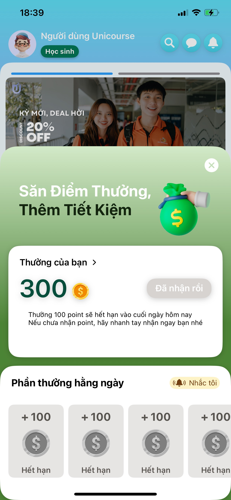
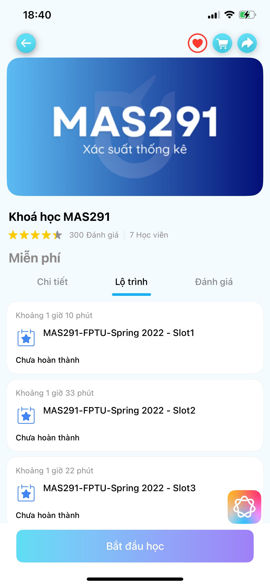
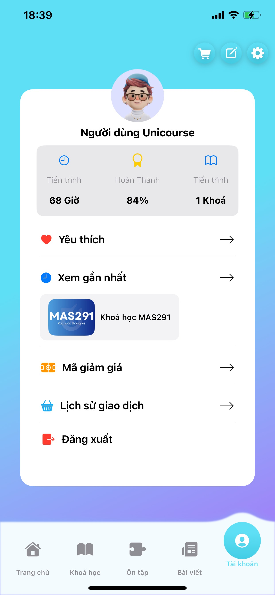

# UNICOURSE - Mobile App cung cấp khóa học trực tuyến

## Giới thiệu

UniCourse là một nền tảng học tập trực tuyến với tài nguyên học tập toàn diện và lộ trình học rõ ràng cho từng sinh viên, đặc biệt phù hợp với từng chuyên ngành học tại trường. Ứng dụng được phát triển với mục tiêu giúp sinh viên tiếp cận và quản lý các khóa học của mình một cách hiệu quả và tiện lợi.

## Tính năng chính

- **Đăng ký và đăng nhập**: Người dùng có thể tạo tài khoản và đăng nhập vào ứng dụng.
- **Xem chi tiết khóa học**: Hiển thị thông tin chi tiết về các khóa học, bao gồm mô tả, lộ trình và tài liệu học tập.
- **Quản lý khóa học**: Cho phép người dùng xem danh sách các khóa học đã đăng ký và theo dõi tiến độ học tập.
- **Giao dịch**: Xem lịch sử giao dịch và chi tiết các khoản thanh toán.
- **Chat**: Tham gia phòng chat để trao đổi và thảo luận với các thành viên khác.
- **Bản đồ**: Xem vị trí của trường Đại học FPT trên Google Maps.

## Cài đặt

1. **Clone repository từ GitHub:**

   ```sh
   git clone https://github.com/prm392-team9/unicourse-android.git

2. **Mở dự án bằng Android Studio:**
- Chọn **Open an existing Android Studio project**.
- Điều hướng đến thư mục unicourse-android và chọn **Open**.

3. **Cài đặt các phụ thuộc:**
- Android Studio sẽ tự động tải và cài đặt các phụ thuộc cần thiết thông qua Gradle.

4. **Chạy ứng dụng:**
- Nhấn vào nút **Run** trên thanh công cụ của Android Studio hoặc nhấn Shift + F10.

## Sử dụng
1. **Đăng ký và Đăng nhập**
- Người dùng mới có thể tạo tài khoản bằng cách sử dụng tính năng đăng ký.
- Người dùng đã có tài khoản có thể đăng nhập để truy cập vào các khóa học và tính năng khác của ứng dụng.

2. **Quản lý khóa học**
- Sau khi đăng nhập, người dùng có thể xem danh sách các khóa học đã đăng ký.
- Người dùng có thể xem chi tiết từng khóa học, bao gồm mô tả và lộ trình học tập.

3. **Giao dịch**
- Người dùng có thể xem lịch sử giao dịch và chi tiết các khoản thanh toán.

4. **Chat**
- Người dùng có thể tham gia các phòng chat để trao đổi và thảo luận với các thành viên khác.

4. **Bản đồ**
- Ứng dụng hiển thị vị trí của trường Đại học FPT trên Google Maps.

## Hình ảnh giao diện

<div style="display: flex; justify-content: center; align-items: center; margin: auto; width: 100%;">
  
  
  
  
</div>

## Cấu trúc dự án
```plaintext

unicourse-android/
├── .idea/
├── app/
│   ├── build/
│   ├── libs/
│   ├── src/
│   │   ├── androidTest/
│   │   │   └── java/
│   │   │       └── com/
│   │   │           └── example/
│   │   │               └── unicourse/
│   │   ├── main/
│   │   │   ├── java/
│   │   │   │   └── com/
│   │   │   │       └── example/
│   │   │   │           └── unicourse/
│   │   │   │               ├── adapters/
│   │   │   │               │   ├── ChatAdapter.java
│   │   │   │               │   ├── CourseAdapter.java
│   │   │   │               │   ├── TransactionAdapter.java
│   │   │   │               ├── constants/
│   │   │   │               │   ├── ApiConstants.java
│   │   │   │               ├── models/
│   │   │   │               │   ├── authentication/
│   │   │   │               │   │   ├── LoginRequest.java
│   │   │   │               │   │   ├── RegisterResponse.java
│   │   │   │               │   │   ├── User.java
│   │   │   │               │   ├── chatroom/
│   │   │   │               │   │   ├── ChatRoomDetail.java
│   │   │   │               │   │   ├── ChatRoomDetailResponse.java
│   │   │   │               │   │   ├── ChatRoomSendMessageResponse.java
│   │   │   │               │   │   ├── Message.java
│   │   │   │               │   ├── course/
│   │   │   │               │   │   ├── Course.java
│   │   │   │               │   │   ├── CoursesResponse.java
│   │   │   │               │   ├── transaction/
│   │   │   │               │   │   ├── HistoryTransaction.java
│   │   │   │               │   │   ├── HistoryTransactionResponse.java
│   │   │   │               ├── services/
│   │   │   │               │   ├── AuthApiService.java
│   │   │   │               │   ├── ChatRoomApiService.java
│   │   │   │               │   ├── CourseApiService.java
│   │   │   │               │   ├── RetrofitClient.java
│   │   │   │               │   ├── TransactionApiService.java
│   │   │   │               ├── ui/
│   │   │   │               │   ├── activities/
│   │   │   │               │   │   ├── ControllerActivity.java
│   │   │   │               │   │   ├── CourseVideoActivity.java
│   │   │   │               │   │   ├── LoginActivity.java
│   │   │   │               │   │   ├── MapsActivity.java
│   │   │   │               │   │   ├── ProfileActivity.java
│   │   │   │               │   │   ├── RegisterActivity.java
│   │   │   │               │   │   ├── TransactionActivity.java
│   │   │   │               │   ├── fragments/
│   │   │   │               │   │   ├── ChatFragment.java
│   │   │   │               │   │   ├── ContactFragment.java
│   │   │   │               │   │   ├── LandingFragment.java
│   │   │   │               ├── viewmodels/
│   │   │   │               │   ├── ChatViewModel.java
│   │   │   │               │   ├── HistoryTransactionViewModel.java
│   │   │   │               │   ├── LandingViewModel.java
│   │   │   ├── res/
│   │   │   │   ├── drawable/
│   │   │   │   │   ├── activity_default_layout.xml
│   │   │   │   │   ├── activity_login_button_background.xml
│   │   │   │   │   ├── activity_login_edittext_background.xml
│   │   │   │   ├── layout/
│   │   │   │   │   ├── activity_default.xml
│   │   │   │   │   ├── activity_landing.xml
│   │   │   │   │   ├── activity_login.xml
│   │   │   │   │   ├── activity_profile.xml
│   │   │   │   │   ├── activity_register.xml
│   │   │   │   │   ├── activity_transaction.xml
│   │   │   │   │   ├── fragment_chat.xml
│   │   │   │   │   ├── fragment_contact.xml
│   │   │   │   │   ├── fragment_landing.xml
│   │   │   │   │   ├── item_transaction.xml
│   │   │   ├── values/
│   │   │   │   ├── colors.xml
│   │   │   │   ├── strings.xml
│   │   │   │   ├── styles.xml
│   │   ├── AndroidManifest.xml
│   ├── build.gradle
├── build.gradle
├── settings.gradle
└── README.md

```

## Đóng góp
Chúng tôi hoan nghênh các đóng góp từ cộng đồng. Vui lòng fork repository và gửi pull request với các tính năng hoặc cải tiến mà bạn muốn thêm vào.

## Liên hệ
Nếu bạn có bất kỳ câu hỏi hoặc góp ý nào, vui lòng liên hệ qua email: unicourse.learningplatform@gmail.com

## Giấy phép
Dự án này được phát hành dưới giấy phép MIT. Vui lòng xem file LICENSE để biết thêm chi tiết.