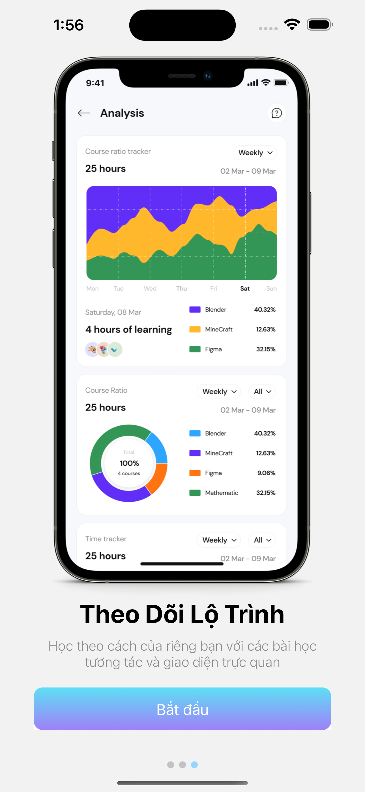

# UNICOURSE - Mobile App cung cấp khóa học trực tuyến

## Các màn hình chính

### ONBOARDING SCREEN

<div style="display: flex; justify-content: center; align-items: center; margin: auto; width: 100%;">
  
  
  
  
</div>

## Project Structure
```plaintext

Unicourse/
├── app/
│   ├── src/
│   │   ├── main/
│   │   │   ├── java/
│   │   │   │   └── com/
│   │   │   │       └── unicourse/
│   │   │   │           ├── adapters/
│   │   │   │           │   └── ControllerAdapter.java
│   │   │   │           ├── models/
│   │   │   │           │   ├── Course.java
│   │   │   │           │   ├── User.java
│   │   │   │           ├── services/
│   │   │   │           │   ├── ApiClient.java
│   │   │   │           │   ├── ApiInterface.java
│   │   │   │           ├── repositories/
│   │   │   │           │   └── ControllerRepository.java
│   │   │   │           ├── ui/
│   │   │   │           │   ├── activities/
│   │   │   │           │   │   ├── LoginActivity.java
│   │   │   │           │   │   ├── MainActivity.java
│   │   │   │           │   │   └── CourseDetailActivity.java
│   │   │   │           └── UnicourseApplication.java
│   │   │   ├── res/
│   │   │   │   ├── drawable/
│   │   │   │   ├── layout/
│   │   │   │   │   ├── activity_login.xml
│   │   │   │   │   ├── activity_main.xml
│   │   │   │   ├── values/
│   │   │   │   │   ├── colors.xml
│   │   │   │   │   ├── strings.xml
│   │   │   │   │   └── styles.xml
│   │   │   │   └── AndroidManifest.xml
│   ├── build.gradle
├── gradle/
├── .gitignore
├── build.gradle
├── gradle.properties
├── gradlew
├── gradlew.bat
├── settings.gradle
└── README.md

```
